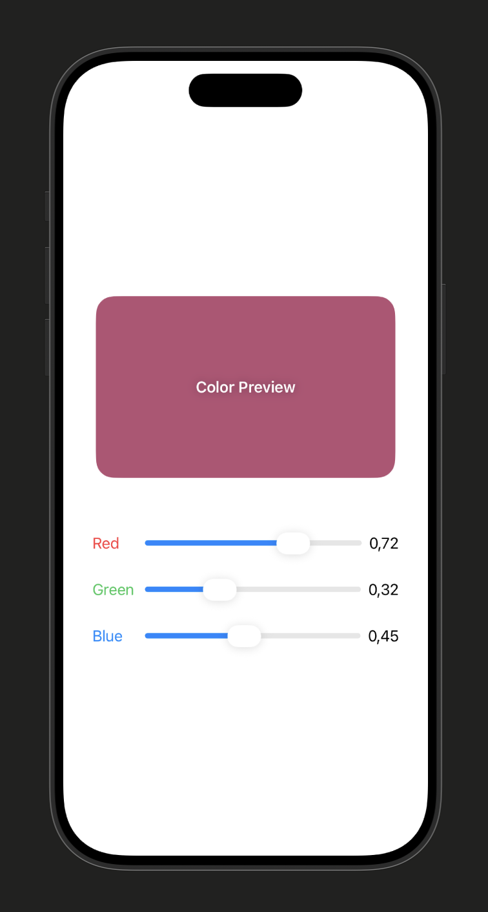

# Color Mixer Mini App 🎨
A simple iOS mini-app built with SwiftUI that allows users to explore and create custom colors by mixing Red, Green, and Blue (RGB) values in real-time.

## Preview

<!--  -->

## Features ✨
- Real-time Preview: Instantly see the color change as you adjust the sliders.
- Precision Control: Fine-tune RGB values with a 0.0 to 1.0 decimal scale.
- Minimalist UI: Designed with a clean, modern aesthetic for effortless color discovery.

## Prerequisites
- Xcode 15.0+
- iOS 17.0+ (Target)

## Installation 🚀
- Clone the repository git clone https://github.com
- Open ColorMixer.xcodeproj in Xcode.
- Select your preferred simulator or physical device.
- Press Cmd + R to build and run.

## Tech Stack 🛠 
- Language: Swift
- Framework: SwiftUI
- Architecture: MVVM (Model-View-ViewModel)
